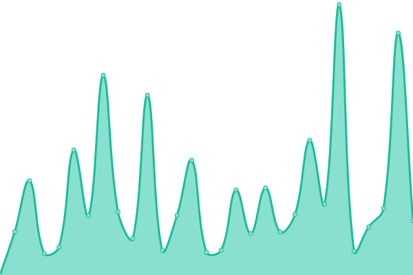

# [📈 Live Status](https://jemmorey.github.io//upptime): <!--live status--> **🟩 All systems operational**

This repository contains the open-source uptime monitor and status page for [jemmorey](https://jemmorey.github.io//upptime), powered by [Upptime](https://github.com/upptime/upptime).

With [Upptime](https://upptime.js.org), you can get your own unlimited and free uptime monitor and status page, powered entirely by a GitHub repository. We use [Issues](https://github.com/jemmorey//upptime/issues) as incident reports, [Actions](https://github.com/jemmorey//upptime/actions) as uptime monitors, and [Pages](https://jemmorey.github.io//upptime) for the status page.

<!--start: status pages-->
<!-- This summary is generated by Upptime (https://github.com/upptime/upptime) -->
<!-- Do not edit this manually, your changes will be overwritten -->
<!-- prettier-ignore -->
| URL | Status | History | Response Time | Uptime |
| --- | ------ | ------- | ------------- | ------ |
|  [SpeakUpConference.com](https://www.speakupconference.com) | 🟩 Up | [speak-up-conference-com.yml](https://github.com/jemmorey/upptime/commits/HEAD/history/speak-up-conference-com.yml) | 

 2821ms
     
 | 

<a href="https://jemmorey.github.io/upptime/history/speak-up-conference-com">95.28%</a>
    

|  [SpeakUpForHope.org](https://www.speakupforhope.org) | 🟩 Up | [speak-up-for-hope-org.yml](https://github.com/jemmorey/upptime/commits/HEAD/history/speak-up-for-hope-org.yml) | 

 3442ms
     
 | 

<a href="https://jemmorey.github.io/upptime/history/speak-up-for-hope-org">95.33%</a>
    

|  [CarolKent.org](https://carolkent.org) | 🟩 Up | [carol-kent-org.yml](https://github.com/jemmorey/upptime/commits/HEAD/history/carol-kent-org.yml) | 

 2924ms
     
 | 

<a href="https://jemmorey.github.io/upptime/history/carol-kent-org">95.54%</a>
    

|  [SpeakUpMinistries.com](https://www.speakupministries.com) | 🟩 Up | [speak-up-ministries-com.yml](https://github.com/jemmorey/upptime/commits/HEAD/history/speak-up-ministries-com.yml) | 

 2416ms
     
 | 

<a href="https://jemmorey.github.io/upptime/history/speak-up-ministries-com">95.59%</a>
    

|  [SpeakUpSpeakerServices.com](https://www.speakupspeakerservices.com) | 🟩 Up | [speak-up-speaker-services-com.yml](https://github.com/jemmorey/upptime/commits/HEAD/history/speak-up-speaker-services-com.yml) | 

 503ms
     
 | 

<a href="https://jemmorey.github.io/upptime/history/speak-up-speaker-services-com">95.79%</a>
    

<!--end: status pages-->

[**Visit our status website →**](https://jemmorey.github.io//upptime)

## 📄 License

- Powered by: [Upptime](https://github.com/upptime/upptime)
- Code: [MIT](./LICENSE) © [jemmorey](https://jemmorey.github.io//upptime)
- Data in the `./history` directory: [Open Database License](https://opendatacommons.org/licenses/odbl/1-0/)
